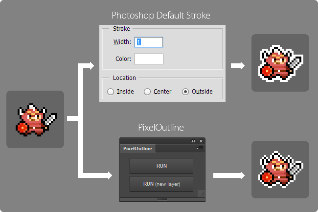

# PixelOutline

PixelOutline is a extension panel for Photoshop CC. An outline of hornless 1px can be drawn by 1 click.

PixelOutline は Photoshop CC用拡張パネルです。1クリックで、角のない 1px の外枠線を描けます。

## Download

In the case of Windows, it can save from a right-click. 

Windows の場合、右クリックから「リンク先のコンテンツを保存」を選択で保存できます。

### zxp file (for Photoshop CC)

* [PaletteChange.zxp](https://raw.github.com/siratama/PixelOutline/master/download/PixelOutline.zxp)

This file is a extension panel for Photoshop CC.
[Extension Manager Command Line tool(ExManCmd)](https://www.adobeexchange.com/resources/28) is required in order to install. 

Photoshop CC 拡張パネル用ファイルです。
インストールには別途 [Extension Manager Command Line tool(ExManCmd)](https://www.adobeexchange.com/resources/28)が必要です。

### jsx file (for Photoshop Any Version)

A jsx file for keyboard short-cut and previous Photoshop version.

キーボードショートカットからの利用や以前の Photoshop のバージョン用として、jsx ファイルも用意しています。

* [PixelOutline.jsx](https://raw.github.com/siratama/PixelOutline/master/download/PixelOutline.jsx)
* [PixelOutlineNewLayer.jsx](https://raw.github.com/siratama/PixelOutline/master/download/PixelOutlineNewLayer.jsx)

Set a jsx file in a "Presets/Scripts/" directory of a Photoshop installation directory.
In case of Windows, PixelOutline.jsx is set in "C:\Program Files\Adobe\Adobe Photoshop CC 2015\Presets\Scripts\".
Then the item of the PixelOutline is appears in [File]-[Scripts] of Photoshop menu.
It's possible to assign a Short-cut Key.

jsx ファイルは、Photoshop インストールディレクトリ内 Presets/Scripts/ ディレクトリに配置する事で利用できます。
例えば Windows の場合、C:\Program Files\Adobe\Adobe Photoshop CC 2015\Presets\Scripts\ 内に PixelOutline.jsx を配置する事で、
Photoshop メニュー[ファイル]-[スクリプト]内に PixelOutline の項目が表示されます。
設定からショートカットキーを割り振ることも可能です。

